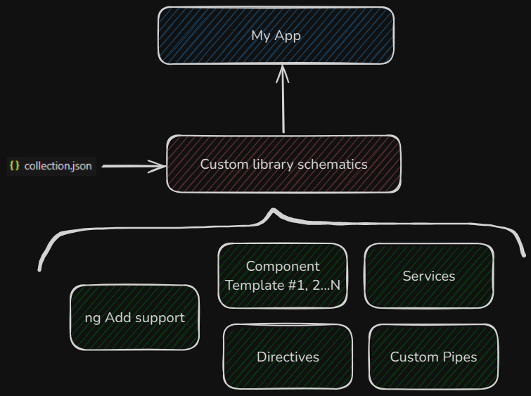
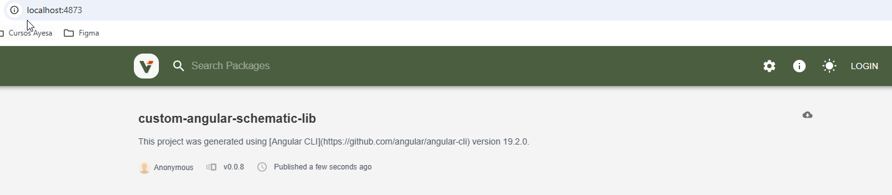

# Custom Angular Schematic Library

## 📚 Project Overview

This Angular library is designed to be integrated into projects that share a similar architecture and design system. Its main purpose is to **streamline development** by providing a set of reusable components, templates, and utilities that can be easily customized and injected into consuming applications.

By leveraging the power of **Angular Custom Schematics**, this library enables developers to:

- Generate pre-defined **pages**, **forms**, **services**, and other reusable artifacts.
- Customize output by specifying parameters such as component names, service names, and more.
- Maintain consistency across multiple projects while speeding up the development process.

This approach ensures that all applications using this library benefit from a standardized structure, while retaining the flexibility to tailor each generated resource to the needs of the individual project.



---

## 🧪 Local Development & Testing

Since this repository contains both an Angular application and a custom schematics library within the same workspace, we can **test the library locally** using the application provided in the project.

The library is already installed in the application using its current version. To edit and re-test the library within the same environment, follow these steps:

### 🔄 Update & Test the Library Locally

1. **Modify or extend the library**  
   Edit or add new functionality to the library located at:  
   ```
   projects/custom-angular-schematic-lib
   ```

2. **Build the library**  
   After making changes, generate a new build by running:
   ```bash
   npm run build-library
   ```

3. **(Optional) Publish the build locally using Verdaccio**  
   If you're using [Verdaccio](https://verdaccio.org/) as a local npm registry, you can publish the updated library locally to simulate a real installation.

4. **Reinstall the updated library in the app**  
   Uninstall the current version:
   ```bash
   npm uninstall custom-angular-schematic-lib
   ```
   Next, install the updated one:
   ```bash
   npm install custom-angular-schematic-lib --registry http://localhost:4873
   ```
   or you can use ngAdd support to install the latest version
   ```bash
   ng add custom-angular-schematic-lib
   ```

5. **Run your schematic for testing**  
   Use the following command to test the new schematic feature:
   ```bash
   ng generate custom-angular-schematic-lib:<new-feature>
   ```
6. **List Available Schematics** 
    To see all the available schematics in the library, run the following command:

    ```bash
    ng generate custom-angular-schematic-lib: --help
    ```

    This will display a list of all schematics provided by the library, along with their descriptions and available options.

---

## 📦 Local Registry with Verdaccio

To simulate a real npm package installation in a local environment, you can use **[Verdaccio](https://verdaccio.org/)**, a lightweight private npm proxy registry. This allows you to publish and install your custom schematics library without affecting the public npm ecosystem.

### ⚙️ Install Verdaccio

Install Verdaccio globally if it's not already installed:

```bash
npm install -g verdaccio
```

### 🚀 Start Verdaccio

Start the Verdaccio server:

```bash
verdaccio
```

By default, it will be available at: [http://localhost:4873](http://localhost:4873)



### 🔐 (Optional) Configure `.npmrc`

To use Verdaccio as your registry, create or update the `.npmrc` file at the project root:

```bash
registry=http://localhost:4873/
```

Alternatively, use the `--registry` flag in npm commands.

### 📤 Publish the Library to Verdaccio

1. Navigate to the library build output folder:

```bash
cd dist/custom-angular-schematic-lib
```

2. Update the version in `package.json` to avoid conflicts.

3. Publish to Verdaccio:

```bash
npm publish --registry http://localhost:4873
```

### 📥 Install the Library in Your Application

From your application root:

```bash
npm uninstall custom-angular-schematic-lib
npm install custom-angular-schematic-lib --registry http://localhost:4873
```

You're now ready to run and test schematics from your locally published library.

---

## 🚀 Example Usage

```bash
ng generate custom-angular-schematic-lib:template
```

This command will generate a page component named `dashboard` and register it in the `app.module.ts`.

To see all the available schematics in the library, run the following command:

```bash
ng generate custom-angular-schematic-lib: --help
```

This will display a list of all schematics provided by the library, along with their descriptions and available options.

---

## 📎 License

MIT
